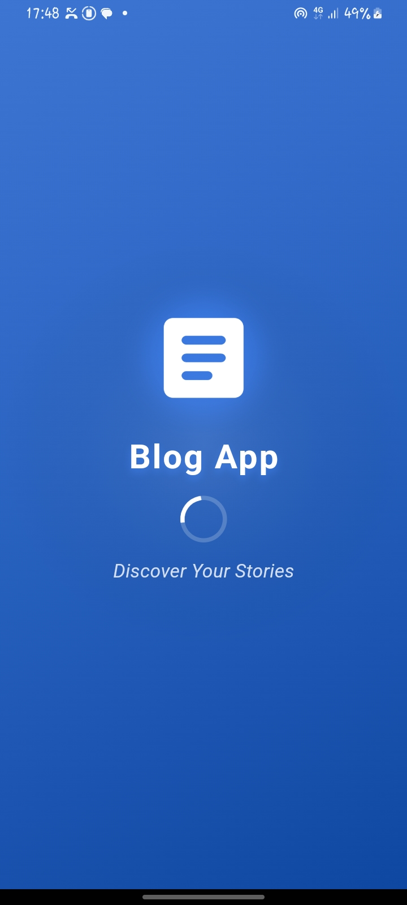
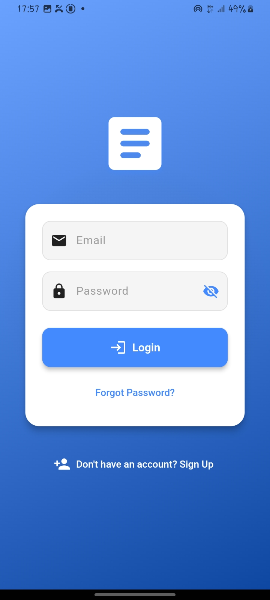
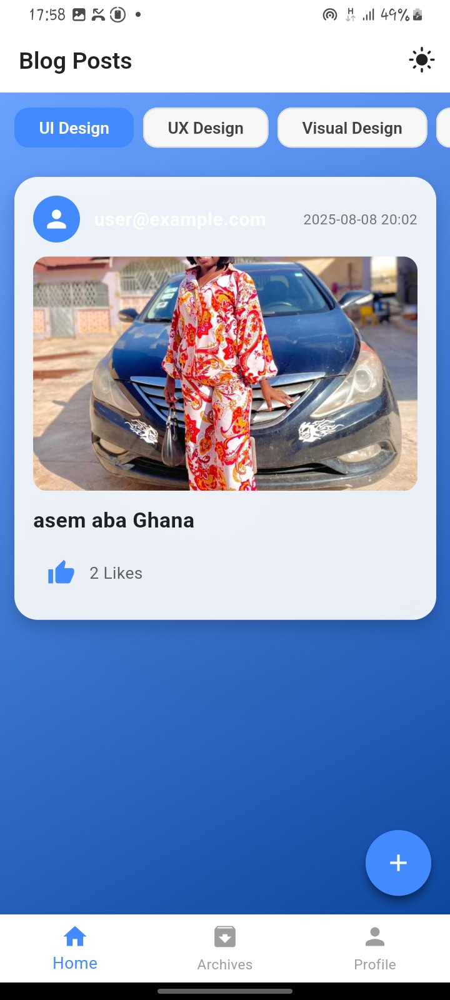
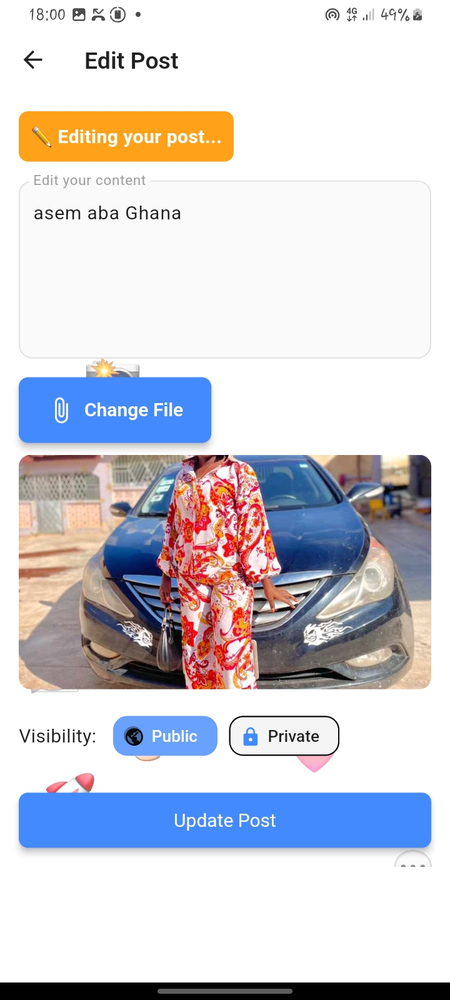
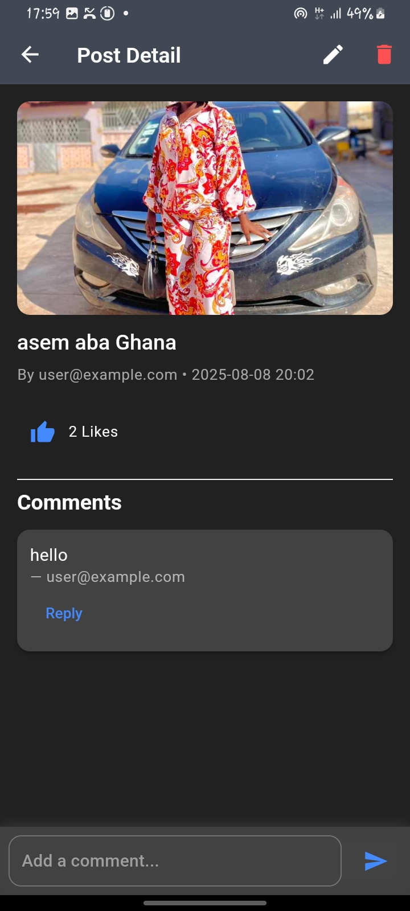

# 📖 Flutter Blog App

A modern and interactive **blog posting app** built with **Flutter** and **Provider** state management.  
This app allows users to create, edit, view, and manage blog posts with file attachments, and supports authentication with persistent user sessions using **Hive**.

---

## 🚀 Features

- **User Authentication**
  - Login / Logout with persistent sessions
  - Local storage using Hive

- **Posts Management**
  - Create posts with text, images, or file attachments (PDF/DOC)
  - Edit existing posts with animations
  - Delete posts
  - Like posts
  - Public and Private visibility settings
  - Post includes metadata (Timestamp,Author's Name)

- **Interactions**
  - Enable (likes,comments,reples to comments)
  - Private posts are stored in user archive (only accessible my user)
  - Public post are displayed 

- **UI & Animations**
  - Splash screen with fade animation
  - Creative post creation/edit screens with emoji backgrounds
  - Smooth transitions and animated form elements
 
- **Navigation**
  - Bottom navigation for Home, Archives, and Profile
  - Floating action button for creating posts
  - Dark mode toggle

---
## Usages
`Login: Use email: abufati@876@gmail.com, password:  24611`.

## 📸 Screenshots

| Splash Screen | Login Page | Home Page | Edit Page | Profile Page | Archive Page | Profile Page | Comment Page |
|--------------|------------|----------- |-----------| ------------ | ------------ | ------------ | ------------ |
| |  |  |   

---

## 🛠️ Tech Stack

**Frontend:**
- [Flutter](https://flutter.dev/)
- [Provider](https://pub.dev/packages/provider)

**Local Storage:**
- [Hive](https://pub.dev/packages/hive)
- [Hive Flutter](https://pub.dev/packages/hive_flutter)

**File Picker:**
- [File Picker](https://pub.dev/packages/file_picker)

---

## 📂 Project Structure

```
lib/
│
├── main.dart                  # App entry point
├── models/                    # Data models (PostModel, Comment, etc.)
├── providers/                 # State management classes
├── routes/                    # App route definitions
├── views/                     # UI screens
│   ├── auth/                  # Login & authentication screens
│   ├── home/                  # Home page & main navigation
│   ├── post/                  # Create, edit, view posts
│   ├── settings/              # Profile & settings pages
│
└── widgets/                   # Reusable UI components
```

---

## ⚙️ Installation & Setup

1. **Clone the repository**
   ```bash
   git clone https://github.com/fati-abu/flutter-blog-app.git
   cd flutter-blog-app
   ```

2. **Install dependencies**
   ```bash
   flutter pub get
   ```

3. **Run the app**
   ```bash
   flutter run
   ```

---
 

---

## 👨‍💻 Author
**Fati Abu**  
 